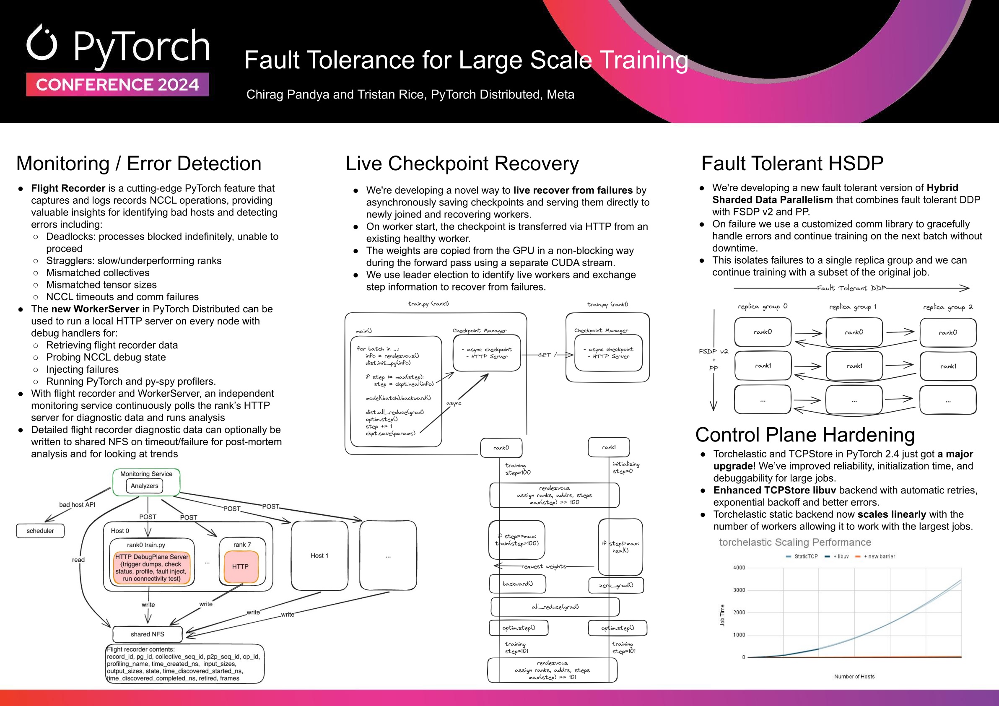

# torchft -- per step fault tolerance for any PyTorch job

> ⚠️ WARNING: This is a prototype for PyTorch fault tolerance and may have bugs
> or breaking changes as this is actively under development. This is a public
> repo to encourage collaboration and contributions are welcome. There currently
> are no plans to make this a stable component of PyTorch Distributed and may be
> abandonded at any time if better approachs arise.

This repository implements techniques for doing a per-step fault tolerance so
you can keep training if errors occur without interrupting the entire training
job.

This is based off of the large scale training techniques presented at PyTorch
Conference 2024.

[](./media/fault_tolerance_poster.pdf)

## Design

torchft is designed to allow for fault tolerance when using training with replicated weights such as in DDP or HSDP (FSDP with DDP).

torchft implements a lighthouse server that coordinates across the different
replica groups and then a per replica group manager and fault tolerance library
that can be used in a standard PyTorch training loop.

This allows for membership changes at the training step granularity which can
greatly improve efficiency by avoiding stop the world training on errors.


## Installation

```sh
$ pip install .
```

This uses pyo3+maturin to build the package, you'll need maturin installed.

To install in editable mode w/ the Rust extensions you can use the normal pip install command:

```sh
$ pip install -e .
```

## Usage

### Lighthouse

The lighthouse is used for fault tolerance across replicated workers (DDP/FSDP)
when using synchronous training.

You can start a lighthouse server by running:

```sh
$ RUST_BACKTRACE=1 torchft_lighthouse --min_replicas 1 --quorum_tick_ms 100 --join_timeout_ms 1000
```

### Example Training Loop (DDP)

See [train_ddp.py](./train_ddp.py) for the full example.

Invoke with:

```sh
$ TORCHFT_MANAGER_PORT=29512 TORCHFT_LIGHTHOUSE=http://localhost:29510 torchrun --master_port 29501 --nnodes 1 --nproc_per_node 1 train.py
```

train.py:

```py
from torchft import Manager, DistributedDataParallel, Optimizer, ProcessGroupGloo

manager = Manager(
    pg=ProcessGroupGloo(),
    load_state_dict=...,
    state_dict=...,
)

m = nn.Linear(2, 3)
m = DistributedDataParallel(manager, m)
optimizer = Optimizer(manager, optim.AdamW(m.parameters()))

for i in range(1000):
    batch = torch.rand(2, 2, device=device)

    optimizer.zero_grad()

    out = m(batch)
    loss = out.sum()

    loss.backward()

    optimizer.step()
```

### Example Parameter Server

torchft has a fault tolerant parameter server implementation built on it's
reconfigurable ProcessGroups. This does not require/use a Lighthouse server.

See [parameter_server_test.py](./torchft/parameter_server_test.py) for an example.

## Tests / Lint

```sh
$ scripts/lint.sh
% scripts/test.sh
```

## Contributing

We welcome PRs! See the [CONTRIBUTING](./CONTRIBUTING.md) file.

## License

torchft is BSD 3-Clause licensed. See [LICENSE](./LICENSE) for more details.
