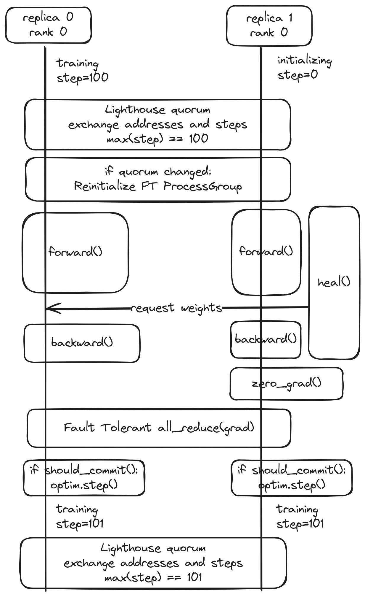

<p align="center">
  <picture>
    <source media="(prefers-color-scheme: dark)" srcset="./media/torchft_logo_dark.svg">
    
  </picture>
</p>

<h3 align="center">
Easy Per Step Fault Tolerance for PyTorch
</h3>

<p align="center">
  | <a href="https://pytorch.org/torchft/"><b>Documentation</b></a>
  | <a href="https://github.com/pytorch/torchft/blob/main/media/fault_tolerance_poster.pdf"><b>Poster</b></a>
  | <a href="https://docs.google.com/document/d/1OZsOsz34gRDSxYXiKkj4WqcD9x0lP9TcsfBeu_SsOY4/edit"><b>Design Doc</b></a>
  |
</p>
<p align="center">
  <a href="https://pypi.org/project/torchft-nightly/"></a>
</p>

---

This repository implements techniques for doing a per-step fault tolerance so
you can keep training if errors occur without interrupting the entire training
job.

[This is based on the large scale training techniques presented at PyTorch
Conference 2024.](./media/fault_tolerance_poster.pdf)

## Overview

torchft is designed to provide the primitives required to implement fault
tolerance in any application/train script as well as the primitives needed to
implement custom fault tolerance strategies.

Out of the box, torchft provides the following algorithms:

* Fault Tolerant DDP
* Fault Tolerant HSDP: fault tolerance across the replicated dimension with any mix of FSDP/TP/etc across the other dimensions.
* LocalSGD
* DiLoCo

To implement these, torchft provides some key reusable components:

1. Coordination primitives that can determine which workers are healthy via
  heartbeating on a per-step basis
2. Fault tolerant ProcessGroup implementations that report errors sanely and be
  reinitialized gracefully.
3. Checkpoint transports that can be used to do live recovery from a healthy
  peer when doing scale up operations.

The following component diagram shows the high level components and how they
relate to each other:



See [torchft's documentation](https://pytorch.org/torchft) for more details.

## Examples

### torchtitan (Fault Tolerant HSDP)

torchtitan provides an out of the box fault tolerant HSDP training loop built on
top of torchft that can be used to train models such as Llama 3 70B.

It also serves as a good example of how you can integrate torchft into your own training script for use with HSDP.

See [torchtitan's documentation for end to end usage](https://github.com/pytorch/torchtitan/blob/main/docs/torchft.md).

### Fault Tolerant DDP

We have a minimal DDP train loop that highlights all of the key components in torchft.

See [train_ddp.py](./train_ddp.py) for more info.


### DiLoCo

LocalSGD and DiLoCo are currently experimental.

See
[the diloco_train_loop/local_sgd_train_loop tests](./torchft/local_sgd_integ_test.py)
for an example on how to integrate these algorithms into your training loop.


## Design

torchft is designed to allow for fault tolerance when using training with replicated weights such as in DDP or HSDP (FSDP with DDP).

See the [design doc](https://docs.google.com/document/d/1OZsOsz34gRDSxYXiKkj4WqcD9x0lP9TcsfBeu_SsOY4/edit) for the most detailed explanation.

### Lighthouse

torchft implements a lighthouse server that coordinates across the different
replica groups and then a per replica group manager and fault tolerance library
that can be used in a standard PyTorch training loop.

This allows for membership changes at the training step granularity which can
greatly improve efficiency by avoiding stopping the world training on errors.


### Fault Tolerant HSDP Algorithm

torchft provides an implementation of a fault tolerant HSDP/DDP algorithm. The
following diagram shows the high level operations that need to happen in the
train loop to ensure everything stays consistent during a healing operation.



See the design doc linked above for more details.

## Installing from PyPI

We have nighty builds available at https://pypi.org/project/torchft-nightly/

To install torchft with minimal dependencies you can run:

```sh
pip install torchft-nightly
```

If you want all development dependencies you can install:

```sh
pip install torchft-nightly[dev]
```

## Installing from Source

### Prerequisites

Before proceeding, ensure you have the following installed:

- Rust (with necessary dependencies)
- `protobuf-compiler` and the corresponding development package for Protobuf.
- PyTorch 2.7 RC+ or Nightly

Note that the Rust versions available in many conda environments may be outdated. To install the latest version of Rust, we recommend downloading it directly from the official website as shown in the below command:
```sh
curl --proto '=https' --tlsv1.2 https://sh.rustup.rs -sSf | sh
```

To install the required packages on a Debian-based system (such as Ubuntu) using apt, run:

```sh
sudo apt install protobuf-compiler libprotobuf-dev
```

or for a Red Hat-based system, run:

```sh
sudo dnf install protobuf-compiler protobuf-devel
```

### Installation

```sh
pip install .
```

This uses pyo3+maturin to build the package, you'll need maturin installed.

If the installation command fails to invoke `cargo update` due to an inability to fetch the manifest, it may be caused by the `proxy`, `proxySSLCert`, and `proxySSLKey` settings in your .`gitconfig` file affecting the `cargo` command. To resolve this issue, try temporarily removing these fields from your `.gitconfig` before running the installation command.

To install in editable mode w/ the Rust extensions and development dependencies, you can use the normal pip install command:

```sh
pip install -e '.[dev]'
```

## Usage

### Lighthouse

The lighthouse is used for fault tolerance across replicated workers (DDP/FSDP)
when using synchronous training.

You can start a lighthouse server by running:

```sh
RUST_BACKTRACE=1 torchft_lighthouse --min_replicas 1 --quorum_tick_ms 100 --join_timeout_ms 10000
```

### Example Training Loop (DDP)

See [train_ddp.py](./train_ddp.py) for the full example.

Invoke with:

```sh
TORCHFT_LIGHTHOUSE=http://localhost:29510 torchrun --master_port 29501 --nnodes 1 --nproc_per_node 1 train_ddp.py
```

train.py:

```py
from torchft import Manager, DistributedDataParallel, Optimizer, ProcessGroupGloo

manager = Manager(
    pg=ProcessGroupGloo(),
    load_state_dict=...,
    state_dict=...,
)

m = nn.Linear(2, 3)
m = DistributedDataParallel(manager, m)
optimizer = Optimizer(manager, optim.AdamW(m.parameters()))

for i in range(1000):
    batch = torch.rand(2, 2, device=device)

    optimizer.zero_grad()

    out = m(batch)
    loss = out.sum()

    loss.backward()

    optimizer.step()
```

### Running DDP

After starting the lighthouse server by running:

```sh
RUST_BACKTRACE=1 torchft_lighthouse --min_replicas 1 --quorum_tick_ms 100 --join_timeout_ms 10000
```

A test DDP script can be launched with torchX with:

```sh
torchx run
```

Or Diloco with:

```sh
USE_STREAMING=True torchx run ./torchft/torchx.py:hsdp --script='train_diloco.py'
```

See [.torchxconfig](.torchxconfig), [torchx.py](./torchft/torchx.py) and the [torchX documentation](https://pytorch.org/torchx/latest/) to understand how DDP is being ran.

`torchx.py` could also launch HSDP jobs when `workers_per_replica` is set > 1, if the training script supports it. For an example HSDP training implementation with torchFT enabled, see [torchtitan](https://github.com/pytorch/torchtitan).

Alternatively, to test on a node with two GPUs, you can launch two replica groups running  [train_ddp.py](./train_ddp.py) by:

On shell 1 (one replica groups starts initial training):
```sh
export REPLICA_GROUP_ID=0
export NUM_REPLICA_GROUPS=2

CUDA_VISIBLE_DEVICES=0 TORCHFT_LIGHTHOUSE=http://localhost:29510 torchrun --master_port=29600 --nnodes=1 --nproc_per_node=1 -- train_ddp.py
```

On shell 2 (a second replica group joins):
```sh
export REPLICA_GROUP_ID=1
export NUM_REPLICA_GROUPS=2

CUDA_VISIBLE_DEVICES=1 TORCHFT_LIGHTHOUSE=http://localhost:29510 torchrun --master_port=29601 --nnodes=1 --nproc_per_node=1 -- train_ddp.py
```

By observing the outputs from both shells, you should observe process group reconfiguration and live checkpoint recovery.

### Example Parameter Server

torchft has a fault tolerant parameter server implementation built on it's
reconfigurable ProcessGroups. This does not require/use a Lighthouse server.

See [parameter_server_test.py](./torchft/parameter_server_test.py) for an example.

## Contributing

We welcome PRs! See the [CONTRIBUTING](./CONTRIBUTING.md) file.

## License

torchft is BSD 3-Clause licensed. See [LICENSE](./LICENSE) for more details.
